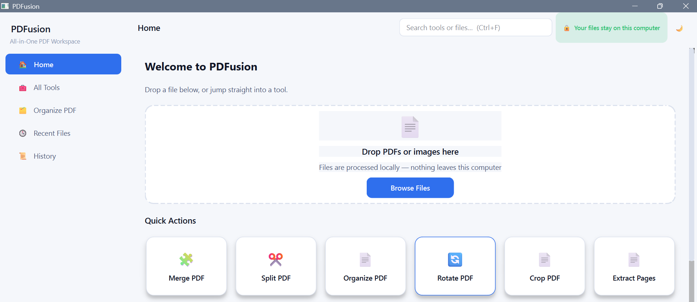
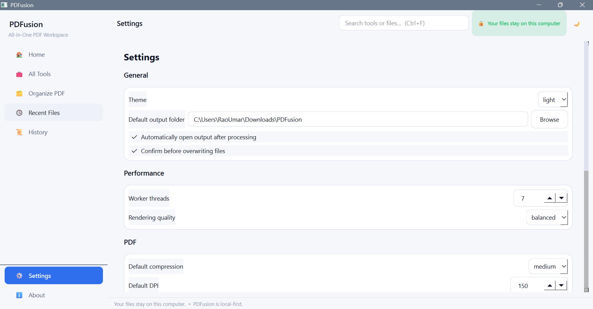

<div align="center">

# 📄 PDFusion

### All-in-One PDF Workspace for Windows

<p>
  <strong>Powerful PDF tools. Local-first processing. Clean desktop experience.</strong>
</p>

<p>
  
</p>

<p>
  
  
  
  
  
  
</p>

<p>
  <a href="#-features">Features</a> •
  <a href="#-screenshots">Screenshots</a> •
  <a href="#-tech-stack">Tech Stack</a> •
  <a href="#-installation">Installation</a> •
  <a href="#-usage">Usage</a> •
  <a href="#-roadmap">Roadmap</a>
</p>

</div>

---

## ✨ Overview

**PDFusion** is a modern, local-first desktop PDF workspace designed to make everyday PDF processing simple, fast, and private.

Instead of sending your documents to an online service, PDFusion is designed around **local processing** — keeping your files on your own computer.

Whether you need to merge documents, split pages, reorganize a PDF, rotate pages, crop content, or extract selected pages, PDFusion provides these workflows through a clean desktop interface.

> 🔒 **Your documents stay on your computer.**

---

## 🚀 Highlights

| | Capability |
|---|---|
| 🖥️ | Modern PySide6 desktop interface |
| 🔐 | Local-first PDF processing |
| 📑 | Built-in PDF viewer |
| 🧩 | Modular application architecture |
| 🖱️ | Drag-and-drop file intake |
| 🌓 | Dark & Light themes |
| 🗂️ | Recent Files & Favorites |
| 📜 | Processing History |
| ⚡ | Background worker processing |
| 🛡️ | Original-file protection |
| 📝 | Detailed application logging |
| 🧪 | Automated testing with PyTest |

---

# 🛠️ Features

## 📌 PDF Operations

### 🔗 Merge PDF

Combine multiple PDF documents into a single file.

- Add multiple PDFs
- Control document order
- Process locally
- Save the resulting document

---

### ✂️ Split PDF

Separate PDF pages into individual documents or selected ranges.

- Select pages
- Define page ranges
- Process in the background
- Save generated files

---

### 🗂️ Organize PDF

Manage the structure of your document with an interactive workflow.

- Reorder pages
- Delete pages
- Duplicate pages
- Insert pages
- Replace pages
- Stage changes before saving

PDFusion protects the original file until changes are explicitly saved.

---

### 🔄 Rotate PDF

Rotate individual pages or PDF content to the correct orientation.

Useful for:

- Scanned documents
- Mixed-orientation PDFs
- Rotated pages
- Document cleanup

---

### ✂️ Crop PDF

Crop PDF pages to remove unwanted margins or content areas.

---

### 📤 Extract Pages

Extract selected pages from an existing PDF into a new document.

---

# 🖥️ Desktop Experience

PDFusion is more than a collection of PDF functions.

It includes a complete desktop workspace with:

- Dashboard
- Sidebar navigation
- Toolbar
- PDF viewer
- Page thumbnails
- Zoom controls
- Recent files
- Favorites
- Processing history
- Settings
- Dependency detection
- Error handling
- Application logging

---

# 🔒 Privacy First

PDFusion follows a **local-first architecture**.

Your documents are processed locally instead of being uploaded to a third-party PDF processing service.

Local application data is stored under:

```text
%APPDATA%/PDFusion/
````

Including:

```text
pdfusion.sqlite3
logs/
temp/
```

The application uses SQLite for local data such as recent files, favorites, history, and settings.

---

# 🎨 Themes

PDFusion supports both:

### 🌙 Dark Mode

A dark interface designed for comfortable extended use.

### ☀️ Light Mode

A clean light interface for users who prefer a brighter workspace.

---

# 📸 Screenshots

## 🚀 Splash Screen

<div align="center">


</div>

---

## 🏠 Home Dashboard

<div align="center">



</div>

---

## ℹ️ About PDFusion

<div align="center">


</div>

---

## 🔗 Merge PDF

<div align="center">


</div>

### After Merging

<div align="center">


</div>

---

## ✂️ Split PDF

<div align="center">


</div>

---

## 🗂️ Organize PDF

<div align="center">


</div>

---

## 🔄 Rotate PDF

<div align="center">


</div>

---

## ✂️ Crop PDF

<div align="center">


</div>

---

## 📤 Extract Pages

<div align="center">


</div>

---

## 📂 Recent Files

<div align="center">


</div>

---

## 📑 Recent Files Tab

<div align="center">


</div>

---

## 📜 Processing History

<div align="center">


</div>

---

## ⚙️ Settings

<div align="center">



</div>

---

## 🌙 Dark Mode

<div align="center">


</div>

---

# 🧰 Tech Stack

<div align="center">

| Technology          | Purpose                              |
| ------------------- | ------------------------------------ |
| 🐍 **Python 3.11+** | Core application                     |
| 🖥️ **PySide6**     | Desktop GUI                          |
| 📄 **PyMuPDF**      | PDF rendering & low-level operations |
| 📚 **pypdf**        | PDF structural operations            |
| 🖼️ **Pillow**      | Image processing                     |
| 🔍 **pytesseract**  | OCR integration                      |
| 🗄️ **SQLite**      | Local application data               |
| 🧪 **PyTest**       | Testing                              |
| 📦 **PyInstaller**  | Application packaging                |

</div>

---

# 🏗️ Architecture

PDFusion follows a modular architecture designed to keep the UI, PDF engine, workers, database, and utilities separated.

```text
PDFusion/
│
├── app/
│   ├── ui/
│   │   ├── views/
│   │   └── widgets/
│   │
│   ├── core/
│   │   └── PDF processing engine
│   │
│   ├── workers/
│   │   └── Background processing
│   │
│   ├── database/
│   │   └── SQLite repositories
│   │
│   └── utils/
│       ├── Logging
│       ├── Error handling
│       ├── Validation
│       └── Dependency detection
│
├── Screenshots/
│
├── tests/
│
├── main.py
├── requirements.txt
├── PHASES.md
└── README.md
```

---

# ⚡ Installation

## 1️⃣ Clone the Repository

```bash
git clone https://github.com/MUdevelops/PDFusion.git
```

```bash
cd PDFusion
```

---

## 2️⃣ Create a Virtual Environment

### Windows

```bash
python -m venv .venv
```

Activate it:

```bash
.venv\Scripts\activate
```

### Linux / macOS

```bash
python3 -m venv .venv
```

```bash
source .venv/bin/activate
```

---

## 3️⃣ Install Dependencies

```bash
pip install -r requirements.txt
```

---

## 4️⃣ Run PDFusion

```bash
python main.py
```

---

# 🖱️ Quick Start

### Step 1

Launch PDFusion.

### Step 2

Open a PDF using the dashboard or drag and drop a document into the application.

### Step 3

Select the operation you need:

```text
Merge
Split
Organize
Rotate
Crop
Extract
```

### Step 4

Configure the operation.

### Step 5

Process the document.

### Step 6

Save the resulting PDF.

Your original document remains protected until you explicitly save changes.

---

# 🧪 Testing

Run the test suite with:

```bash
pytest tests/
```

For a quieter test output:

```bash
pytest tests/ -q
```

---

# 📦 Project Status

### Phase 2 — Complete ✅

Current implementation includes:

```text
✅ Application Shell
✅ Dashboard
✅ Sidebar Navigation
✅ Dark / Light Theme
✅ PDF Viewer
✅ Drag & Drop
✅ Recent Files
✅ Favorites
✅ Processing History
✅ Settings
✅ Dependency Detection
✅ Logging
✅ Error Handling
✅ Merge PDF
✅ Split PDF
✅ Organize PDF
✅ Rotate PDF
✅ Crop PDF
✅ Extract Pages
✅ Background Processing
```

---

# 🗺️ Roadmap

PDFusion is being developed incrementally with functional verification at every phase.

### Phase 3 — Convert & Optimize

```text
⬜ Compress PDF
⬜ Images → PDF
⬜ PDF → JPG / PNG
⬜ Metadata
⬜ Watermark
⬜ Page Numbers
```

### Phase 4 — Security & Markup

```text
⬜ Protect PDF
⬜ Unlock PDF
⬜ Digital Signature
⬜ Annotation
⬜ Redaction
⬜ Advanced Cropping
```

### Phase 5 — OCR & Office Conversion

```text
⬜ OCR
⬜ Searchable PDF
⬜ DOCX Conversion
⬜ XLSX Conversion
⬜ PPTX Conversion
⬜ Advanced Optimization
```

### Phase 6 — Batch & Packaging

```text
⬜ Batch Processing Queue
⬜ Performance Optimization
⬜ Extended Test Coverage
⬜ PyInstaller Build
⬜ Windows Installer
```

---

# 🔐 Optional Dependencies

Some advanced PDF workflows can use external system tools.

| Dependency        | Purpose                  |
| ----------------- | ------------------------ |
| **Tesseract OCR** | OCR functionality        |
| **LibreOffice**   | Office ↔ PDF conversion  |
| **Ghostscript**   | Advanced PDF compression |

These dependencies are detected by PDFusion where applicable.

---

# 📁 Local Data

PDFusion creates its local application data directory automatically.

### Windows

```text
%APPDATA%\PDFusion
```

Structure:

```text
PDFusion/
├── pdfusion.sqlite3
├── logs/
│   └── app.log
└── temp/
```

Temporary files are cleaned automatically during application startup.

---

# 🧑‍💻 Development

Clone the project:

```bash
git clone https://github.com/MUdevelops/PDFusion.git
cd PDFusion
```

Create the environment:

```bash
python -m venv .venv
.venv\Scripts\activate
```

Install dependencies:

```bash
pip install -r requirements.txt
```

Run:

```bash
python main.py
```

Test:

```bash
pytest tests/
```

---

# 🤝 Contributing

Contributions, suggestions, bug reports, and feature ideas are welcome.

If you want to contribute:

1. Fork the repository
2. Create a feature branch
3. Implement your changes
4. Test your changes
5. Commit your work
6. Open a Pull Request

Example:

```bash
git checkout -b feature/my-feature
```

---

# 📜 License

PDFusion is released under the **MIT License**.

See [`LICENSE`](LICENSE) for details.

---

# 👨‍💻 Author

<div align="center">

### Muhammad Umar Jamal

**Software Developer | BSCS Student | Builder**

I build practical software projects focused on automation, AI, desktop applications, and modern developer tools.

<br>

<a href="https://github.com/MUdevelops">
  
</a>

</div>

---

<div align="center">

## ⭐ Support PDFusion

If you find PDFusion useful, consider giving the repository a ⭐ on GitHub.

<br>

**Built with Python • Designed for Privacy • Made for Productivity**

<br>


</div>

[2]: https://github.com/MUdevelops/PDFusion/blob/main/requirements.txt "PDFusion/requirements.txt at main · MUdevelops/PDFusion · GitHub"
